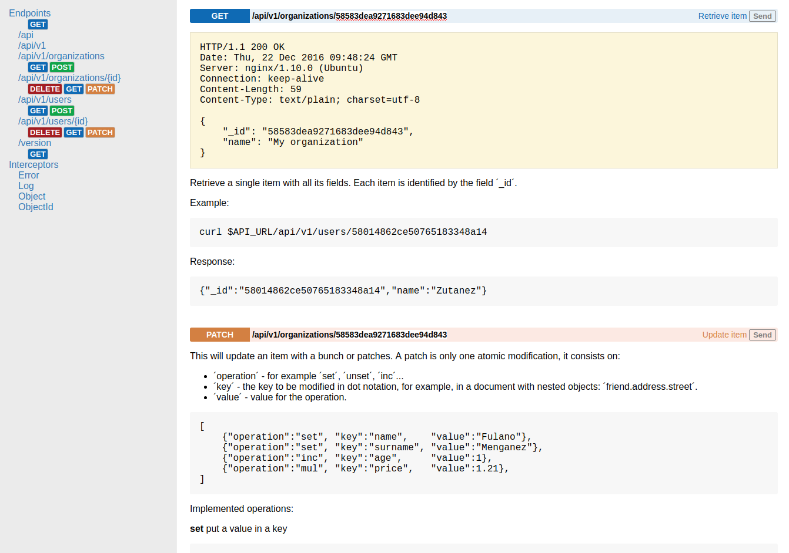

# ApiDoc

<p align="center">
<a href="https://travis-ci.org/fulldump/apidoc"></a>
<a href="https://goreportcard.com/report/fulldump/apidoc"></a>
<a href="https://godoc.org/github.com/fulldump/apidoc"></a>
</p>

Autogenerate online documentation for golax REST APIs.

<!-- MarkdownTOC autolink=true bracket=round depth=4 -->

- [How to use](#how-to-use)
- [Testing](#testing)
- [ApiDoc developer](#apidoc-developer)

<!-- /MarkdownTOC -->





## How to use

```go
    my_api := golax.NewApi()
    apidoc.Build(my_api, my_api.Root)
```

## Testing

```sh
make setup && make test
```

To see code coverage:

```sh
make setup && make coverage
```


## ApiDoc developer

If you want to develop ApiDoc, maybe you want to regenerate the
file `files.go` with the new static files:

```sh
go run utils/genstatic.go --dir=static/ --package=apidoc > files.go
```
